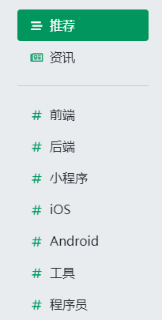
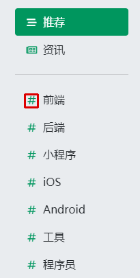

# findimage - 在大图中找小图

本项目不是图像搜索，不能从一堆图片中找到相似的那张，而是从一张大图中定位给定模板小图的位置。

find the template image (smaller) in a source image (bigger)

以前这种功能，我都是用aircv实现的，但网易这个项目很久没有维护了，提交PR也没人处理，所以单独做了一个。
原项目还有一些别的图像处理API，本项目专注于找小图功能，所以干脆就叫findimage。

## 示例
比如我们对“思否”课程菜单截图如下：



我们想从中找到#的位置，可以提供一张小模板图：

然后调用find_template方法：

```python
from cv2 import cv2
from findimage import find_template

image_origin = cv2.imread('seg_course_whole_page.png')
image_template = cv2.imread('seg_sharp.png')

match_result = find_template(image_origin, image_template)
```

得到的match_result，标识了第一个#在源图中的中心点位置，矩形区域四角坐标 和 匹配度。

```json
{
    "result": (x,y),        #tuple，表示识别结果的中心点
    "rectangle":[            #二位数组，表示识别结果的矩形四个角
        [left, top],
        [left, bottom],
        [right, top],
        [right, bottom]
    ],
    "confidence": percentage   #识别结果的匹配度,在-1~1之间，越大匹配度越高, 如果为1，表示按像素严格匹配
}
```

我们可以用这个结果，在源图上标识出匹配的位置：
```python
img_result = image_origin.copy()
rect = match_result['rectangle']
cv2.rectangle(img_result, (rect[0][0], rect[0][1]), (rect[3][0], rect[3][1]), (0, 0, 220), 2)
cv2.imwrite('result.png', img_result)
```

结果如下图所示：
